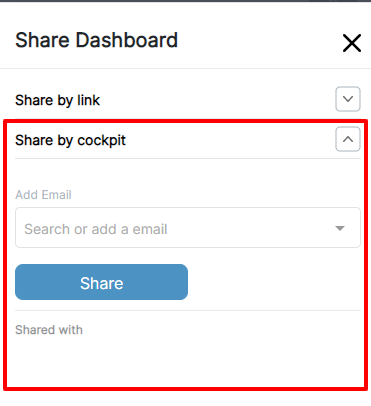
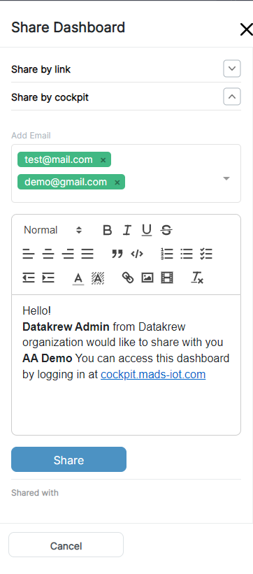
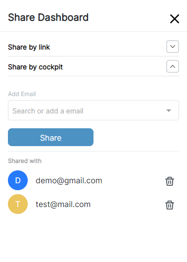
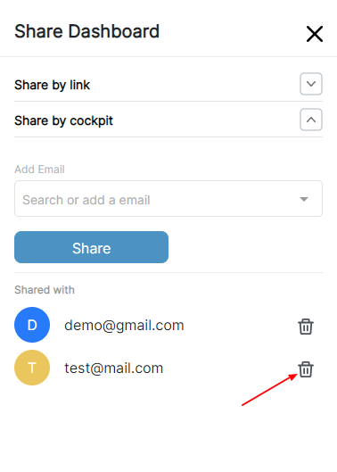

A Dashboard can be shared to others by a link.  
Dashboard can be shared in two different ways  

* Using Link
* Using CockPit

### 1. Using link

* Public: Can be viewed with link only.
* Private Can be viewed with link and password of the dashboard.

To share a dashboard, click on the shared icon at top right corner of the dashboard header.


Once we click on share button, Sidebar will be apear on the right side as sown below.  


## Share dashboard as public (Using link)

To share a dashboard as public, select the public radio button and then click on Generate Link.  



## Share dashboard as private (Using link)

To share a dashboard as private, click the priave radio button and enter the password which will be needed when someone access the dashboard by a link.  
Then click on Generate Link and dashboard will be exported as a private dashboard.  

  
We can then share the link and password of the private dashboard.
When someone opens the private dashboard with the link, first it will be prompt with the modal to enter password.

After user enters the password, then they can view the dashboard as shown below

If the user forgot the password of the dashboard, then password can be revealed with the help of the MADS application password which user has used to logged in to the application.
  
On clicking the reveal password, user will have to enter the password and then click on next button, after that password will be visible.  



## Update shared dashboard access

When the dashboard is already shared as Public or Private, it can be changed to Private or Public respectively.  
If user wants to Change private dashboard to public, then first they have to click on public radio button and then enter the MADS application password as shown below.  
  
Click on the save button, once password is verified, then the dashboard access will be changed to public.  

After changing the access of the dashboard, link will be the same, so all users with the link can view the dashboard without any password.  


### 2. Using CockPit
  To share dashboard using CockPit   
  1. Open CockPit section in Sidebar   
  {{}}   
  2. User can share dashboard with single or multipel email ids  
  Once emails are enterd, Email template will be shown as below, user can modify this template if he/she wants to. 
  After template modification done, click on share button.  
  {{}}  
  Once the Sharing is completed, user can see the list of emails with dashboard was shared  
  {{}}  
  If user wants to revert access of perticular shared user, then user can delte that perticular shared emil id.  
  {{}}
  
